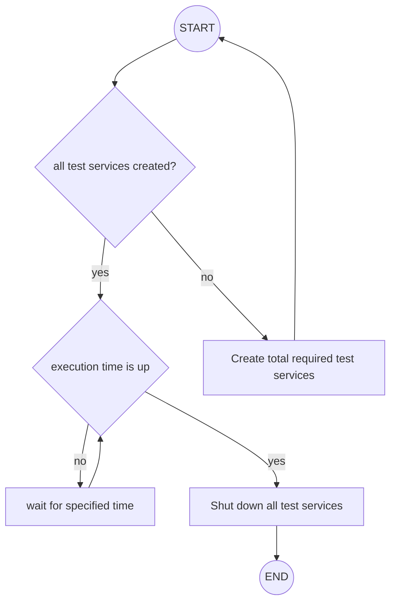

Test scenario categorization based on how it should be executed:

- A (total test service + total execution time): smoke, load, soak, spike.
- B (step execution + increase rate): stress.
- C: (total test service + step execution + increase rate): scalability.
- D: (total test service + step execution + increase rate + decrease rate): recovery.

## Group A

